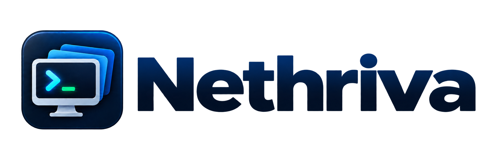

# Nethriva

Nethriva is an open-source native macOS connection manager for local terminal, SSH, SFTP, and RDP sessions. It uses a SwiftUI application shell with AppKit-hosted terminal and remote-desktop surfaces, keeps multiple live sessions organized in tabs, and stores saved credentials in macOS Keychain.

The current release is Nethriva 0.10.0. When upgrading from the earlier project name, saved connections, connection groups, and Keychain passwords are migrated automatically on first access.

## At a glance

| Capability | Implementation | Opens in a tab | File transfer |
|---|---|---:|---:|
| Local terminal | SwiftTerm with a real macOS pseudo-terminal | Yes | Local filesystem |
| SSH | macOS OpenSSH hosted inside SwiftTerm | Yes | Integrated SFTP tree |
| SFTP browser | macOS SFTP with authenticated connection reuse | Yes | Upload, download, move, and drag-and-drop |
| RDP | Bundled FreeRDP 3.31.1 with a native Cocoa bridge | Yes | Clipboard and Finder file/folder transfer |

Nethriva is currently distributed as an Xcode project. The project folder contains the application source, tests, application and brand assets, the native RDP bridge source, a bundled Apple-silicon RDP runtime, and its third-party license notices.

## Requirements and current platform support

- macOS 14 or later
- Xcode with the macOS development tools installed
- Apple-silicon Mac for the currently bundled RDP runtime
- Network access to the SSH, SFTP, or RDP hosts you want to use
- Remote hosts with SSH/SFTP or RDP enabled and reachable from the Mac
- Valid credentials, an SSH key or agent, or another authentication method accepted by the remote host

The Xcode project pins its Swift package dependencies. RDP is self-contained in the app resources and does not require a separate package-manager installation.

## Complete feature and capability list

### Native macOS workspace

- Original Nethriva app icon, wordmark, and adaptive blue accent color
- Complete macOS icon set from 16 × 16 through 1024 × 1024
- Branded empty-workspace state using the application mark
- Native Swift and SwiftUI application with AppKit integration where direct system-view hosting is required
- Resizable split-view layout with a hideable, width-adjustable connection sidebar
- Minimum application size of 900 × 600 for a usable session workspace
- Horizontal session tab bar with protocol-specific icons and close controls
- Independent local terminal, SSH, SFTP, and RDP tabs
- Resizable remote-file tree displayed beside every SSH terminal
- Multiple tabs for the same saved connection
- Session preservation while switching between open tabs
- Automatic selection of the next available tab when the current tab closes
- Empty-workspace screen with a shortcut to open the selected connection
- Complete offline help manual in a dedicated resizable window
- Searchable help navigation covering every connection and session type, security, shortcuts, limitations, and troubleshooting
- Help access from the toolbar, the macOS Help menu, and Command-?
- Keyboard commands:
  - Command-O opens the selected connection
  - Command-Shift-U opens SFTP for the selected SSH connection

### Connection library and sidebar

- Built-in Local Terminal connection
- Saved SSH and RDP connections
- Persistent connection data and custom groups
- Favorites section for frequently used connections
- Create, edit, duplicate, move, favorite, and delete connections
- Create persistent empty groups and remove unused empty groups
- Add a connection directly to a selected group
- Alphabetical group and connection ordering
- Single-click selection and double-click opening
- Sidebar Add menu for new connections and groups
- Selected-connection action menu
- Context menus on every connection
- One-click Open button in the sidebar footer
- Copy a connection address to the clipboard
- Copy a ready-to-use SSH command, including a non-default port when configured
- Connection type, host, port, username, password, group, and favorite fields
- Protocol-specific settings that appear only when relevant
- Saved connection compatibility defaults for data created by earlier versions

### Credential handling and security

- Password storage in macOS Keychain, indexed by the connection identifier
- Passwords are not encoded into the persistent connection database
- Editing a connection can keep the existing password or replace it
- Duplicating a connection safely copies its Keychain credential to a new Keychain item
- Deleting a connection also deletes its saved credential
- SSH host verification through the system OpenSSH `known_hosts` workflow
- Changed SSH host keys remain protected by OpenSSH checks
- RDP certificate policies:
  - Trust on first use
  - Require a valid certificate
  - Ignore certificate warnings, with an in-app warning
- RDP credentials are passed to the embedded client in-process and do not appear in a separate RDP process list
- Sensitive RDP device redirection features are disabled unless explicitly enabled for a connection

### Local terminal

- Login shell launched from the user's configured `SHELL`, with `/bin/zsh` as the fallback
- Starts in the user's home directory
- Real pseudo-terminal session hosted in SwiftTerm
- ANSI and xterm-compatible terminal rendering
- 256-color and true-color support through the terminal environment
- Direct keyboard input
- Text selection and clipboard operations
- Command-V paste
- Two-finger trackpad click or mouse secondary-click paste
- Automatic terminal row and column resizing with the tab
- Terminal process remains alive while switching tabs
- Closing the tab terminates its local process

### SSH sessions

- Interactive SSH sessions embedded directly in a tab
- Compact remote filesystem tree displayed beside the live terminal
- Resizable divider between the remote tree and terminal
- Lazy folder expansion so only opened directories are requested
- Parent-folder, home-folder, refresh, new-folder, and upload controls in the tree
- Double-click a remote folder to use it as the tree root
- Double-click a remote file to choose a download destination
- Drag local files or folders onto the tree root or a remote folder to upload them
- Drag a remote file or folder onto another remote folder to move it
- Drag a remote file or folder out to Finder to download it
- Remote path copying and explicit download actions from the tree context menu
- Native terminal rendering, keyboard input, selection, copy, and paste
- Uses the macOS OpenSSH client and the user's existing SSH environment
- Reuses each authenticated OpenSSH transport for its terminal and file operations, avoiding a new login handshake for every expanded folder
- Supports existing `~/.ssh/config` settings
- Supports existing `known_hosts` entries
- Supports private keys and `ssh-agent`
- Inherits `SSH_AUTH_SOCK`, locale, and relevant shell environment values
- Authentication modes:
  - Automatic configuration and agent discovery
  - Password or keyboard-interactive only
  - Public-key only
- Optional per-connection identity file with a native file chooser
- Optional jump host
- SSH agent forwarding
- SSH compression
- Configurable keepalive interval with missed-response handling
- Custom SSH ports
- First-use fingerprint confirmation in the session terminal
- Password-prompt detection with a visible explanation that terminal password input is hidden
- Send Saved Password button for the current Keychain credential
- Exit-status display when a session ends
- Reconnect control without reopening the saved connection
- Correct terminal focus after opening and after sending a saved password

### SFTP file browser

- SFTP opens as a separate tab associated with an SSH connection
- Uses the same host, port, username, authentication preference, identity file, jump host, agent, and compression settings as SSH
- Uses the saved Keychain password when required
- Honors the system SSH host-key database; an unknown key can be reviewed through an SSH session before file access
- Remote working-directory display with selectable path text
- Directory listing with folders first
- File and folder names, sizes, modification values, permissions, and symbolic-link indicators
- File-type icons for images, archives, scripts, source files, links, and general documents
- Double-click folder navigation
- Parent-folder and home-folder navigation
- Refresh control
- Empty-folder state
- Multiple-file and folder upload through a native file picker
- Recursive folder upload
- Drag-and-drop file and folder upload into the browser
- Download a selected file or folder through a native destination panel
- Recursive folder download
- Create remote folders
- Rename remote files and folders
- Delete remote files
- Delete empty remote folders with confirmation
- Loading and activity indicators
- Fast folder expansion through authenticated OpenSSH connection reuse
- Item count and endpoint status bar
- Actionable authentication, host-key, timeout, permission, and server-response errors
- Shortcut from an SFTP error to the associated SSH session

Recursive deletion of non-empty remote folders is not currently enabled.

### Embedded RDP sessions

- RDP desktops rendered directly inside Nethriva tabs
- Bundled FreeRDP 3.31.1 runtime and native Cocoa view bridge
- No separate RDP application or external RDP window
- Network Level Authentication credentials
- Domain-qualified usernames, including `DOMAIN\\user` parsing
- Custom RDP ports
- Correct mouse-coordinate translation inside the tab
- Primary click, secondary click, dragging, pointer movement, and wheel scrolling
- Trackpad two-finger secondary-click menus at the correct remote location
- Direct keyboard focus and input in the embedded desktop
- Automatic keyboard-focus recovery whenever the embedded desktop is clicked
- Bidirectional Unicode text clipboard redirection
- Native Command-C, Command-X, Command-V, and Command-A mapping to the matching Windows shortcuts
- Paste toolbar action for Mac text and copied Finder files
- Finder file and folder drops directly into the active Windows desktop or folder
- Remote drop-point activation so the desktop or Explorer window beneath the pointer receives the paste
- Standard RDP file-clipboard streaming without creating a duplicate local transfer folder
- File-paste feedback for drag-and-drop and copied Finder items
- Dynamic resolution based on the tab's logical dimensions rather than doubled Retina backing pixels
- Automatic remote resize when the application window changes size
- Automatic remote resize when the sidebar is shown, hidden, or resized
- Continuous drawing and pointer scaling while the remote host applies a new layout
- Per-session interface-size control:
  - Comfortable — 100%
  - Larger — 140%
  - Largest — 180%
- Saved interface scale per connection
- Modern 32-bit H.264/AVC444 graphics pipeline
- Software graphics fallback when modern acceleration is disabled
- Compression and selectable network profiles:
  - Automatic
  - LAN
  - Fast broadband
  - Limited broadband
  - WAN
  - Very slow link
- Remote audio options:
  - Play on this Mac
  - Play on the remote computer
  - Disabled
- Optional microphone redirection
- Optional home-folder redirection
- Optional custom-folder redirection with a native folder chooser
- Optional printer redirection
- Optional smart-card redirection
- Optional USB-device redirection
- Remote Desktop Gateway host and gateway username
- Administrative-session connection option
- Automatic reconnection with a configurable retry limit
- Per-tab connection phase, endpoint, resolution, and interface-scale status
- Disconnect and reconnect controls
- Actionable messages for rejected credentials, unreachable services, remote disconnects, and FreeRDP errors

### Session and process lifecycle

- Every local terminal and SSH tab owns its own pseudo-terminal process
- Every embedded RDP tab owns its own native client context
- Every SFTP tab performs operations independently while safely reusing the matching authenticated OpenSSH transport
- Switching tabs does not terminate active sessions
- Closing a tab releases its terminal process or RDP client resources
- Connection deletion closes tabs associated with that saved connection
- RDP view focus is restored after connection
- RDP resizing is debounced to avoid flooding the remote host during window movement

### Persistence and testing

- Connection and group persistence through macOS user defaults
- Backward-compatible decoding for saved connections without newer SSH or RDP fields
- Keychain-backed credential abstraction for testability
- Unit coverage for:
  - Default protocol ports
  - Legacy connection compatibility
  - SSH option persistence
  - RDP compatibility defaults
  - Secure RDP argument construction and password redaction
  - Dynamic-resolution argument selection
  - Embedded tab sizing
  - Logical-size handling on Retina displays
  - Per-session RDP scale overrides
  - Windows domain and username parsing
  - Bundled runtime configuration
  - Session-tab identity and selection
  - Connection, credential, and group persistence behavior
- Native bridge smoke validation for creation, loading, resizing, startup failure handling, shutdown, and code signing

## Build and run

1. Open `Nethriva.xcodeproj` in Xcode.
2. Select the `Nethriva` scheme and the `My Mac` destination.
3. Choose **Product → Clean Build Folder** after replacing an older project or bundled RDP runtime.
4. Press Command-R.
5. Double-click Local Terminal, SSH, or RDP connections to open them.
6. For file management, right-click an SSH connection and choose **Open SFTP Browser**.

On the first build, Xcode resolves the pinned terminal and SSH packages. It may ask once to trust the terminal package's build-information plugin.

App Sandbox is intentionally disabled because Nethriva launches local terminal and system SSH/SFTP processes. Local and community Release builds can use Xcode's **Sign to Run Locally** option without a paid Apple Developer account. Developer ID signing and notarization are optional improvements for a warning-free first launch, not requirements for building or sharing the open-source application.

## Open-source Release builds

Nethriva can be built and shared without a paid Apple Developer account:

1. Select the Nethriva target in Xcode and open **Signing & Capabilities**.
2. For Release, use **Team: None** and **Signing Certificate: Sign to Run Locally**. If the certificate control is not visible, set **Code Signing Identity** for Release to **Sign to Run Locally** under Build Settings.
3. Select the Nethriva scheme and an Apple-silicon Mac destination.
4. Choose **Product → Archive**.
5. In Organizer, choose **Distribute App → Custom → Copy App**.

The exported `Nethriva.app` is an optimized Release build. Because it is not signed with an Apple-issued Developer ID or notarized, a Mac that downloads the app may block its first launch. A user who has reviewed and trusts the source and release checksum can attempt to open the app once and then approve it through **System Settings → Privacy & Security → Open Anyway**.

Prebuilt ZIP or DMG files belong on the GitHub Releases page rather than in the source repository. Publish a SHA-256 checksum with each binary release. The source repository intentionally excludes local build products, archives, disk images, and the `outputs` working directory.

### First-run checklist

1. Open the built-in Local Terminal to confirm terminal rendering and keyboard input.
2. Create an SSH or RDP connection from the sidebar's **Add** menu.
3. Enter a friendly name, host, port, username, group, and any protocol-specific options.
4. Optionally enter a password. It is saved in macOS Keychain rather than in the connection record.
5. Double-click the connection, select it and press Command-O, or use **Open** from its context menu.
6. For an SSH host, review and accept its fingerprint when OpenSSH asks for first-use confirmation.
7. For remote file management, choose **Open SFTP Browser** or use the file tree beside the SSH terminal.

No Nethriva account, hosted service, or external connection database is required.

## Usage notes

### SSH host trust

New SSH hosts show the standard fingerprint question in the SSH tab. Review the fingerprint and enter `yes` to store the host key. Password input is intentionally invisible; type or paste the password and press Return.

### SFTP host trust

The SFTP browser does not automatically accept an unknown server key. Open an SSH tab for that connection first, verify the fingerprint, accept it, and then reopen or refresh SFTP.

### RDP sizing

RDP automatically follows the visible session area. Changing the window, sidebar, or interface-size control sends an updated remote display layout. Start with Comfortable; use Larger or Largest when Windows text and controls need more magnification.

### RDP authentication

For a domain account, enter the username as `DOMAIN\\username` or put the domain in the dedicated Domain field. A logon-failure message normally means Windows rejected the username, domain, or password rather than a network or display problem.

### Keyboard, pointer, and clipboard controls

| Action | Control |
|---|---|
| Open the selected connection | Command-O |
| Open SFTP for the selected SSH connection | Command-Shift-U |
| Paste into a terminal | Command-V |
| Paste into a terminal with a pointing device | Secondary-click or two-finger click |
| Send common edit shortcuts to Windows | Command-C, Command-X, Command-V, and Command-A |
| Open a Windows context menu | Secondary-click or two-finger click inside the RDP view |
| Transfer Finder items to Windows | Copy them and use the RDP paste action, or drag them into the RDP view |
| Resize the remote Windows desktop | Resize the app, resize or hide the sidebar, or change the interface-size control |

### Typical workflows

#### Organize connections

Create groups from the sidebar Add menu, add connections directly to a group, and mark frequently used entries as favorites. The selected-connection menu and row context menu expose opening, editing, duplication, moving, address copying, SSH-command copying, and deletion actions.

#### Work with SSH and remote files together

Opening an SSH connection creates a terminal with a remote filesystem tree beside it. Expand only the directories you need, drag local files or folders onto the tree to upload them, drag remote items between folders to move them, or drag a remote item to Finder to download it. The divider can be resized without interrupting the terminal.

#### Use the full SFTP browser

Open the SFTP browser when you need a larger file-management workspace. It supports navigation, directory creation, rename, upload, download, recursive folder transfer, move, and deletion of files or empty directories. It inherits the SSH connection's host, port, authentication, key, jump-host, agent, and compression settings.

#### Use an embedded Windows desktop

Opening an RDP connection places the desktop in the selected session tab. The desktop tracks the usable tab size, including sidebar changes, and can be magnified independently with Comfortable, Larger, or Largest interface scaling. Clipboard text, copied Finder items, and direct Finder drops can be sent to the active Windows desktop or Explorer window.

## Data storage, privacy, and migration

- Connections and group names are stored locally in macOS user defaults.
- Passwords are stored as generic-password items in macOS Keychain and are keyed by each connection's UUID.
- Password values are not written into the connection JSON or included in logged FreeRDP command arguments.
- SSH uses the current macOS user's OpenSSH configuration, keys, agent socket, and `known_hosts` file.
- Temporary SSH multiplexing sockets use hashed names below `/private/tmp/Nethriva-*` and expire through OpenSSH's configured persistence window.
- RDP certificate behavior is selected per connection; **Require Valid Certificate** is the strictest option.
- Clipboard, microphone, folders, printers, smart cards, USB devices, and similar RDP redirects remain under per-connection control.
- Data from the preceding application identity is imported automatically when no corresponding Nethriva data exists. Migrated Keychain items are copied into Nethriva's current Keychain service when first read.
- Nethriva does not provide cloud synchronization, telemetry, or a hosted relay service in this release.

## Troubleshooting

### SSH tab connects but will not accept a password

Click inside the terminal to give it keyboard focus. Password characters are intentionally not echoed. Type the password and press Return, paste it with Command-V, or use **Send Saved Password** when a Keychain password is available.

### SSH host authenticity prompt keeps returning

Confirm that the host, port, and fingerprint are correct, enter `yes` in the SSH terminal, and ensure the current macOS user can write to `~/.ssh/known_hosts`. A changed host key must be investigated rather than automatically replaced.

### Remote files do not appear

Establish and trust the SSH connection first, then refresh the tree or SFTP browser. Check that the server enables the SFTP subsystem, that the account can execute SFTP, and that it has permission to list the requested directory. Authentication, host-key, timeout, permission, and malformed-response errors are shown in the file browser.

### SSH or SFTP feels slow

Confirm latency and name resolution outside Nethriva, then check jump-host and compression settings. Nethriva reuses authenticated OpenSSH transports, but the first connection still performs DNS lookup, host-key verification, and authentication. Very large directories are faster when navigated through the lazy SSH tree instead of repeatedly refreshing a broad SFTP listing.

### RDP reports logon failure

Verify the username, password, and domain. For Active Directory accounts, use `DOMAIN\\username` or fill the Domain field separately. Confirm that the Windows account is allowed to use Remote Desktop and that Network Level Authentication accepts the supplied account.

### RDP pointer or interface size feels wrong

Use a resizable app window and let the connection settle after a layout change. Choose Larger or Largest for more readable Windows controls. Nethriva sends logical tab dimensions rather than Retina backing-pixel dimensions and recalculates the remote layout when the sidebar or window changes.

### RDP clipboard or file transfer does not work

Confirm that **Share clipboard** is enabled for the connection and that the Windows host or its policy does not disable clipboard redirection. Copy a Finder item and use the RDP paste action, or drop the item directly over the intended remote desktop or Explorer destination.

### Xcode cannot resolve packages

Check network access, choose **File → Packages → Reset Package Caches**, and build again. Package versions are pinned in `Package.resolved`. After replacing an older project archive, use **Product → Clean Build Folder** so Xcode does not reuse stale products.

## Current limitations

- The bundled RDP runtime is currently built for Apple silicon; an Intel-compatible RDP bundle is not included.
- Recursive deletion of non-empty remote SFTP directories is intentionally disabled.
- SFTP does not automatically trust an unknown SSH host key; approve the host through an SSH tab first.
- Connection and group data are local to the current Mac user and are not synchronized between Macs.
- There is no connection import/export UI, credential-sharing service, or team vault yet.
- RDP device redirection depends on both FreeRDP support and the remote Windows host's policy and configuration.
- Gateway passwords do not have a separate saved-credential field in the current connection editor.
- Release packaging automation, Apple Developer ID signing, notarization, automatic updates, and an installer remain future deployment work. Unsigned open-source Release builds can still be exported and shared now.

## Technology stack

| Area | Technology |
|---|---|
| Application language | Swift |
| Project and build system | Xcode project with Swift Package Manager dependencies |
| Application UI | SwiftUI with focused AppKit integration |
| Terminal emulation | SwiftTerm 1.20.0 |
| SSH terminal transport | macOS OpenSSH and pseudo-terminal process hosting |
| SFTP operations | macOS SFTP with reusable OpenSSH control connections |
| SSH library groundwork | SwiftNIO, NIO SSH, NIO Core, and NIO Posix |
| RDP | Bundled FreeRDP 3.31.1 and an Objective-C/Cocoa bridge |
| Credentials | macOS Security framework and Keychain |
| Connection persistence | Codable models stored through `UserDefaults` |
| Cryptography support | CryptoKit for SSH host-key identity groundwork; OpenSSL within the bundled RDP runtime |
| Tests | XCTest plus native RDP bridge smoke validation |

The package lock records the exact revisions used by the project. Third-party notices for the bundled RDP runtime are under `Nethriva/Resources/FreeRDP/ThirdPartyLicenses` and summarized in [`THIRD_PARTY_NOTICES.md`](THIRD_PARTY_NOTICES.md).

## Support Nethriva

Nethriva is free and open-source software. If it saves you time and you would like to support its continued development, you can leave a [one-time tip through Ko-fi](https://ko-fi.com/vsharapov) or [sponsor the project through GitHub Sponsors](https://github.com/sponsors/vitalii-sharapov). Support is entirely optional and does not change the features or permissions provided by the Apache License 2.0.

## License and contributing

Nethriva is licensed under the [Apache License 2.0](LICENSE). Third-party components remain under their respective licenses. See [CONTRIBUTING.md](CONTRIBUTING.md) before submitting a change and [SECURITY.md](SECURITY.md) for safe vulnerability reporting.

## Release notes

### 0.10.0

- Added a complete offline Nethriva help manual bundled with the application.
- Added a dedicated native help window with a navigable table of contents, full-text highlighting, light and dark appearance support, and print-friendly formatting.
- Added Help-menu and toolbar entry points plus the standard Command-? shortcut.
- Added coverage for connection setup, local terminal, SSH, remote file navigation, SFTP, RDP, file transfer, security, troubleshooting, and current limitations.

### 0.9.1

- Renamed the product, project, target, tests, app bundle, user-facing strings, and brand assets to Nethriva.
- Added the Nethriva wordmark and complete macOS icon catalog.
- Added one-time migration for existing connection records, connection groups, and Keychain passwords.
- Preserved the already-built private RDP bridge ABI so embedded RDP behavior remains compatible after the product rename.

## Project structure

```text
Nethriva/
├── App/                       Application entry point and shared state
├── Models/                    Connections and session-tab models
├── Services/                  Persistence, Keychain, SFTP, and FreeRDP adapters
├── Sessions/                  Embedded SSH transport groundwork
├── Resources/Help/            Bundled offline HTML help manual
├── Resources/FreeRDP/         Bundled RDP runtime and third-party notices
└── Views/
    ├── Help/                  Native help-window integration
    ├── Sidebar/               Connection manager and protocol editors
    └── Sessions/              Tabs, terminals, SFTP browser, and RDP surface
NethrivaTests/               Model, persistence, lifecycle, and argument tests
Vendor/NethrivaRDPBridge/    Source for the native embedded RDP bridge
docs/                          Architecture and integration notes
```

Additional implementation and packaging details are available in [`docs/INTEGRATION_PLAN.md`](docs/INTEGRATION_PLAN.md). Brand usage and reproducible asset prompts are documented in [`docs/BRAND_ASSETS.md`](docs/BRAND_ASSETS.md).

## Command-line build verification

```sh
DEVELOPER_DIR=/Applications/Xcode.app/Contents/Developer \
  xcodebuild -project Nethriva.xcodeproj \
  -scheme Nethriva \
  -configuration Debug \
  -derivedDataPath .derivedData \
  CODE_SIGNING_ALLOWED=NO build
```

The test target also runs directly from Xcode. Restricted automation environments may block macOS package or test services even when the project itself builds normally in Xcode.
