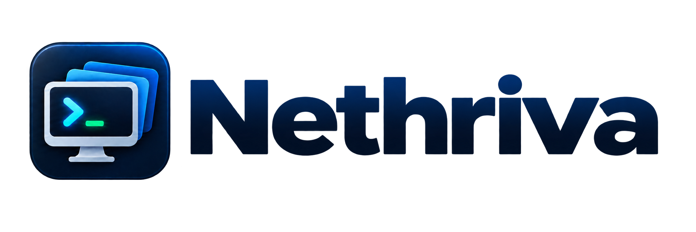

# Nethriva

Nethriva is an open-source native macOS connection manager for local terminal, SSH, Telnet, Serial, SFTP, and RDP sessions. It uses a SwiftUI application shell with AppKit-hosted terminal and remote-desktop surfaces, keeps multiple live sessions organized in tabs, and stores saved credentials in macOS Keychain.

The current project version is Nethriva 0.12.1 (build 26). A GitHub binary release is published separately from source updates.

## At a glance

| Capability | Implementation | Opens in a tab | File transfer |
|---|---|---:|---:|
| Local terminal | SwiftTerm with a real macOS pseudo-terminal | Yes | Local filesystem |
| SSH | macOS OpenSSH hosted inside SwiftTerm | Yes | Integrated SFTP tree |
| Telnet | Native TCP client with Telnet option negotiation and SwiftTerm | Yes | No |
| Serial | Native USB/serial device I/O with SwiftTerm | Yes | No |
| SFTP browser | macOS SFTP with authenticated connection reuse | Yes | Upload, download, move, and drag-and-drop |
| RDP | Bundled FreeRDP 3.31.1 with a native Cocoa bridge | Yes | Clipboard and Finder file/folder transfer |

Nethriva is currently distributed as an Xcode project. The project folder contains the application source, tests, application and brand assets, the native RDP bridge source, a bundled Apple-silicon RDP runtime, and its third-party license notices.

## Requirements and current platform support

- macOS 14 or later
- Xcode with the macOS development tools installed
- Apple-silicon Mac for the currently bundled RDP runtime
- Network access to the SSH, Telnet, SFTP, or RDP hosts you want to use
- Remote hosts with the required SSH/SFTP, Telnet, or RDP service enabled and reachable from the Mac
- Valid credentials, an SSH key or agent, or another authentication method accepted by the remote host

The Xcode project pins its Swift package dependencies. RDP is self-contained in the app resources and does not require a separate package-manager installation.

## Complete feature and capability list

### Native macOS workspace

- Original Nethriva app icon, wordmark, and adaptive blue accent color
- Complete macOS icon set from 16 × 16 through 1024 × 1024
- Branded empty-workspace state using the application mark
- Native Swift and SwiftUI application with AppKit integration where direct system-view hosting is required
- Resizable split-view layout with a hideable, width-adjustable connection sidebar
- Minimum application size of 900 × 600 for a usable session workspace
- Horizontal session tab bar with protocol-specific icons and close controls
- Compact title bar, session tabs, and RDP controls to leave more room for the remote desktop
- Independent local terminal, SSH, Telnet, Serial, SFTP, and RDP tabs
- Resizable remote-file tree displayed beside every SSH terminal
- Multiple tabs for the same saved connection
- Session preservation while switching between open tabs
- Automatic selection of the next available tab when the current tab closes
- Empty-workspace screen with a shortcut to open the selected connection
- Complete offline help manual in a dedicated resizable window
- Searchable help navigation covering every connection and session type, security, shortcuts, limitations, and troubleshooting
- Help access from the toolbar, the macOS Help menu, and Command-?
- Native Settings window available from the app menu, toolbar, or Command-,
- Separate movable Credential Profiles manager for shared SSH, Telnet, and RDP accounts
- Keyboard commands:
  - Command-F focuses the sidebar connection search
  - Command-O opens the selected connection
  - Command-Shift-U opens SFTP for the selected SSH connection

### Connection library and sidebar

- Built-in Local Terminal connection
- Saved SSH, Telnet, Serial, and RDP connections
- Persistent connection data and expandable nested groups
- Sidebar search by connection name, hostname/IP address, group path, or port; multiple terms can be combined
- Favorites section for frequently used connections
- Create, edit, quickly rename, duplicate, move, favorite, and delete connections
- Create persistent groups and subgroups; remove a group while moving its connections to Ungrouped
- Right-click a group to add a connection or subgroup, rename it, expand or collapse it, copy its path, or remove it
- Add a connection directly to a selected group
- Command-click to toggle individual connections or folders, or Shift-click to select a visible range of the same kind
- Drag selected connections to another group; drag a folder to move its entire subtree, including empty subfolders
- Drag connections to Favorites to add them there, or to Ungrouped to remove their group assignment
- Alphabetical group and connection ordering
- Single-click selection and double-click opening
- Sidebar Add menu for new connections and groups
- Selected-connection action menu
- Context menus on every connection
- One-click Open button in the sidebar footer
- Copy a connection address to the clipboard
- Copy a ready-to-use SSH command, including a non-default port when configured
- Connection type, endpoint, protocol-specific settings, group, and favorite fields
- Optional reusable credential profile selected per SSH, Telnet, or RDP connection
- Independent sidebar and session privacy settings for host addresses and usernames; usernames are hidden by default
- Protocol-specific settings that appear only when relevant
- Saved connection compatibility defaults for data created by earlier versions
- Import and export from the File menu, toolbar connection-library menu, or sidebar footer
- Credential-free exports containing connection settings, favorites, groups, and empty groups
- Optional password-protected exports containing saved Keychain credentials
- Import preview with connection, group, credential, and duplicate counts
- Duplicate handling that can keep existing records or replace matching connection identifiers

### Credential handling and security

- Password storage in macOS Keychain, indexed by a connection or reusable credential-profile identifier
- Named reusable credential profiles with username, optional Windows domain, and a single shared Keychain password
- Profile password rotation updates every linked connection on its next session; existing sessions stay active
- Shared profiles cannot be deleted while a connection uses them; interactive RDP credential saving detaches only that connection
- Passwords are not encoded into the persistent connection database
- Editing a connection can keep, replace, or explicitly remove the existing password
- Keychain items use the device-local, available-only-while-unlocked accessibility class
- Duplicating a connection safely copies its Keychain credential to a new Keychain item
- Deleting a connection also deletes its saved credential
- SSH host verification through the system OpenSSH `known_hosts` workflow
- Changed SSH host keys remain protected by OpenSSH checks
- RDP certificate policies:
  - Trust on first use
  - Require a valid certificate
  - Ignore certificate warnings, with an in-app warning
- RDP credentials are passed to the embedded client in-process and do not appear in a separate RDP process list
- Sensitive RDP device redirection features are disabled unless explicitly enabled for a connection
- SFTP passwords are delivered through a private pipe rather than process arguments or environment variables
- SFTP command paths containing control characters are rejected before reaching the command channel
- Credential-free connection archives cannot contain passwords
- Credential exports encrypt the complete archive with AES-256-GCM and a PBKDF2-HMAC-SHA256 derived key
- Export files are created with permissions restricted to the current macOS user
- Password-free exports include profile metadata and usernames but no passwords; encrypted exports can include shared profile passwords

### Telnet sessions

- Interactive Telnet sessions embedded directly in a SwiftTerm tab
- Native TCP transport using Network.framework, with no external Telnet executable required
- Negotiation support for terminal type, echo, suppress-go-ahead, and window-size updates
- Direct keyboard input, Command-V paste, secondary-click paste, and terminal resizing
- Custom host and port, with port 23 as the default
- Login/username- and password-prompt detection with explicit Send Saved Username and Send Saved Password actions
- Reconnect control after a session closes or fails
- Persistent warnings that Telnet sends credentials and session data without encryption

### Serial sessions

- Saved serial-console connections for USB-to-serial adapters, including USB-to-RJ45 console cables that expose a serial device on macOS
- Live discovery and manual refresh of available `/dev/cu.*` ports in the connection editor; a device path may also be entered manually
- Baud rates from 300 through 230400, 7/8 data bits, none/even/odd parity, 1/2 stop bits, and none/hardware/software flow control
- Optional local echo, SwiftTerm keyboard input, Command-V paste, and secondary-click paste
- Independent tab lifecycle, disconnection notice, and reconnect control
- Serial device paths and settings can be imported/exported with the connection library; no serial credentials are requested or saved
- The adapter must be connected and accessible to the current macOS user when the session opens

### Local terminal

- Login shell launched from the user's configured `SHELL`, with `/bin/zsh` as the fallback
- Starts in the user's home directory
- Real pseudo-terminal session hosted in SwiftTerm
- ANSI and xterm-compatible terminal rendering
- 256-color and true-color support through the terminal environment
- Direct keyboard input
- Text selection and clipboard operations
- Command-V paste
- Two-finger trackpad click or mouse secondary-click paste
- Automatic terminal row and column resizing with the tab
- Terminal process remains alive while switching tabs
- Closing the tab terminates its local process

### SSH sessions

- Interactive SSH sessions embedded directly in a tab
- Compact remote filesystem tree displayed beside the live terminal
- Resizable divider between the remote tree and terminal
- Lazy folder expansion so only opened directories are requested
- Parent-folder, home-folder, refresh, new-folder, and upload controls in the tree
- Double-click a remote folder to use it as the tree root
- Double-click a remote file to choose a download destination
- Drag local files or folders onto the tree root or a remote folder to upload them
- Drag a remote file or folder onto another remote folder to move it
- Drag a remote file or folder out to Finder to download it
- Remote path copying and explicit download actions from the tree context menu
- Native terminal rendering, keyboard input, selection, copy, and paste
- Uses the macOS OpenSSH client and the user's existing SSH environment
- Reuses each authenticated OpenSSH transport for its terminal and file operations, avoiding a new login handshake for every expanded folder
- Explicitly closes a reusable SSH transport when its last associated tab closes and when Nethriva quits
- Removes stale per-process control-socket directories left by terminated app instances
- Supports existing `~/.ssh/config` settings
- Supports existing `known_hosts` entries
- Supports private keys and `ssh-agent`
- Inherits `SSH_AUTH_SOCK`, locale, and relevant shell environment values
- Authentication modes:
  - Automatic configuration and agent discovery
  - Password or keyboard-interactive only
  - Public-key only
- Optional per-connection identity file with a native file chooser
- Optional jump host
- SSH agent forwarding
- SSH compression
- Configurable keepalive interval with missed-response handling
- Custom SSH ports
- First-use fingerprint confirmation in the session terminal
- Password-prompt detection with a visible explanation that terminal password input is hidden
- Send Saved Password button for the current Keychain credential
- Exit-status display when a session ends
- Reconnect control without reopening the saved connection
- Correct terminal focus after opening and after sending a saved password

### SFTP file browser

- SFTP opens as a separate tab associated with an SSH connection
- Uses the same host, port, username, authentication preference, identity file, jump host, agent, and compression settings as SSH
- Uses the saved Keychain password when required
- Honors the system SSH host-key database; an unknown key can be reviewed through an SSH session before file access
- Remote working-directory display with selectable path text
- Directory listing with folders first
- File and folder names, sizes, modification values, permissions, and symbolic-link indicators
- File-type icons for images, archives, scripts, source files, links, and general documents
- Double-click folder navigation
- Parent-folder and home-folder navigation
- Refresh control
- Empty-folder state
- Multiple-file and folder upload through a native file picker
- Recursive folder upload
- Drag-and-drop file and folder upload into the browser
- Download a selected file or folder through a native destination panel
- Recursive folder download
- Create remote folders
- Rename remote files and folders
- Delete remote files
- Delete empty remote folders with confirmation
- Loading and activity indicators
- Fast folder expansion through authenticated OpenSSH connection reuse
- Item count and endpoint status bar
- Actionable authentication, host-key, timeout, permission, and server-response errors
- Shortcut from an SFTP error to the associated SSH session

Recursive deletion of non-empty remote folders is not currently enabled.

### Embedded RDP sessions

- RDP desktops rendered directly inside Nethriva tabs
- Bundled FreeRDP 3.31.1 runtime and native Cocoa view bridge
- No separate RDP application or external RDP window
- Network Level Authentication credentials
- Domain-qualified usernames, including `DOMAIN\\user` parsing
- Custom RDP ports
- Correct mouse-coordinate translation inside the tab
- Primary click, secondary click, dragging, pointer movement, and wheel scrolling
- Trackpad two-finger secondary-click menus at the correct remote location
- Direct keyboard focus and input in the embedded desktop
- Automatic keyboard-focus recovery whenever the embedded desktop is clicked
- Bidirectional Unicode text clipboard redirection
- Native Command-C, Command-X, Command-V, and Command-A mapping to the matching Windows shortcuts
- Paste toolbar action for Mac text and copied Finder files
- Finder file and folder drops directly into the active Windows desktop or folder
- Remote drop-point activation so the desktop or Explorer window beneath the pointer receives the paste
- Standard RDP file-clipboard streaming without creating a duplicate local transfer folder
- File-paste feedback for drag-and-drop and copied Finder items
- Dynamic resolution based on the tab's logical dimensions rather than doubled Retina backing pixels
- Automatic remote resize when the application window changes size
- Automatic remote resize when the sidebar is shown, hidden, or resized
- Continuous drawing and pointer scaling while the remote host applies a new layout
- Per-session interface-size control:
  - Comfortable — 100%
  - Larger — 140%
  - Largest — 180%
- Saved interface scale per connection
- Modern 32-bit H.264/AVC444 graphics pipeline
- Software graphics fallback when modern acceleration is disabled
- Compression and selectable network profiles:
  - Automatic
  - LAN
  - Fast broadband
  - Limited broadband
  - WAN
  - Very slow link
- Remote audio options:
  - Play on this Mac
  - Play on the remote computer
  - Disabled
- Optional microphone redirection
- Optional home-folder redirection
- Optional custom-folder redirection with a native folder chooser
- Optional printer redirection
- Optional smart-card redirection
- Optional USB-device redirection
- Remote Desktop Gateway host and gateway username
- Administrative-session connection option
- Automatic reconnection with a configurable retry limit
- Per-tab connection phase, endpoint, resolution, and interface-scale status
- Disconnect and reconnect controls
- Actionable messages for rejected credentials, unreachable services, remote disconnects, and FreeRDP errors

### Session and process lifecycle

- Every local terminal and SSH tab owns its own pseudo-terminal process
- Every Telnet tab owns an independent TCP connection and protocol-negotiation state
- Every embedded RDP tab owns its own native client context
- Every SFTP tab performs operations independently while safely reusing the matching authenticated OpenSSH transport
- Switching tabs does not terminate active sessions
- Closing a tab releases its terminal, Telnet, reusable SSH transport, or RDP client resources as appropriate
- Connection deletion closes tabs associated with that saved connection
- RDP view focus is restored after connection
- RDP resizing is debounced to avoid flooding the remote host during window movement

### Persistence and testing

- Versioned connection persistence through macOS user defaults
- Last-known-good connection backup with automatic recovery and a visible warning if the primary store is damaged
- Backward-compatible decoding for saved connections without newer SSH or RDP fields
- Separate Debug and Release connection stores and Keychain services; neither store is bundled into the app
- Keychain-backed credential abstraction for testability
- Unit coverage for:
  - Default protocol ports
  - Legacy connection compatibility
  - SSH option persistence
  - RDP compatibility defaults
  - Secure RDP argument construction and password redaction
  - Dynamic-resolution argument selection
  - Embedded tab sizing
  - Logical-size handling on Retina displays
  - Per-session RDP scale overrides
  - Windows domain and username parsing
  - Bundled runtime configuration
  - Session-tab identity and selection
  - Connection, credential, and group persistence behavior
  - Telnet negotiation, control-byte filtering, and literal-IAC escaping
  - SFTP secret isolation and control-character rejection
  - Corrupt connection-store recovery
  - Plain and encrypted connection-archive round trips
  - Credential exclusion, group preservation, duplicate handling, and development-data isolation
  - Redacted diagnostic-export behavior
- Native bridge smoke validation for creation, loading, resizing, startup failure handling, shutdown, and code signing
- GitHub Actions checks for tests, an unsigned Release build, and the bundled RDP bridge symbol
- Redacted diagnostic export from the Help menu; connection names, hosts, usernames, credentials, file paths, and session logs are excluded

## Build and run

1. Open `Nethriva.xcodeproj` in Xcode.
2. Select the `Nethriva` scheme and the `My Mac` destination.
3. Choose **Product → Clean Build Folder** after replacing an older project or bundled RDP runtime.
4. Press Command-R.
5. Double-click Local Terminal, SSH, Telnet, or RDP connections to open them.
6. For file management, right-click an SSH connection and choose **Open SFTP Browser**.

On the first build, Xcode resolves the pinned SwiftTerm package. It may ask once to trust the package's build-information plugin.

Debug builds started from Xcode use an isolated development connection library and Keychain service. That development data persists across Xcode builds, so pressing Run again shows clients you previously saved in Debug. Release builds on the same Mac likewise reopen that Mac’s existing Release library. Neither library nor its Keychain passwords are embedded in `Nethriva.app` or transferred to a new user with a GitHub release ZIP. A first-time user starts with only Local Terminal. Export files are separate artifacts: do not attach a personal `.nethriva` or `.nethriva-secure` archive to a release.

App Sandbox is intentionally disabled because Nethriva launches local terminal and system SSH/SFTP processes. Local and community Release builds can use Xcode's **Sign to Run Locally** option without a paid Apple Developer account. Developer ID signing and notarization are optional improvements for a warning-free first launch, not requirements for building or sharing the open-source application.

## Open-source Release builds

Nethriva can be built and shared without a paid Apple Developer account:

1. Select the Nethriva target in Xcode and open **Signing & Capabilities**.
2. For Release, use **Team: None** and **Signing Certificate: Sign to Run Locally**. If the certificate control is not visible, set **Code Signing Identity** for Release to **Sign to Run Locally** under Build Settings.
3. Select the Nethriva scheme and an Apple-silicon Mac destination.
4. Choose **Product → Archive**.
5. In Organizer, choose **Distribute App → Custom → Copy App**.

The exported `Nethriva.app` is an optimized Release build. Because it is not signed with an Apple-issued Developer ID or notarized, a Mac that downloads the app may block its first launch. A user who has reviewed and trusts the source and release checksum can attempt to open the app once and then approve it through **System Settings → Privacy & Security → Open Anyway**.

Prebuilt ZIP or DMG files belong on the GitHub Releases page rather than in the source repository. Publish a SHA-256 checksum with each binary release. The source repository intentionally excludes local build products, archives, disk images, and the `outputs` working directory.

For a repeatable local package, run `scripts/build-release.sh`. It creates a clean Release application, ZIP, DMG, and SHA-256 files under `release-artifacts/`. See [`docs/RELEASE_CHECKLIST.md`](docs/RELEASE_CHECKLIST.md) and [`docs/COMPATIBILITY.md`](docs/COMPATIBILITY.md).

### First-run checklist

1. Open the built-in Local Terminal to confirm terminal rendering and keyboard input.
2. Create an SSH, Telnet, or RDP connection from the sidebar's **Add** menu.
3. Enter a friendly name, host, port, username, group, and any protocol-specific options.
4. Optionally enter a password. It is saved in macOS Keychain rather than in the connection record.
5. Double-click the connection, select it and press Command-O, or use **Open** from its context menu.
6. For an SSH host, review and accept its fingerprint when OpenSSH asks for first-use confirmation.
7. For remote file management, choose **Open SFTP Browser** or use the file tree beside the SSH terminal.

No Nethriva account, hosted service, or external connection database is required.

## Usage notes

### SSH host trust

New SSH hosts show the standard fingerprint question in the SSH tab. Review the fingerprint and enter `yes` to store the host key. Password input is intentionally invisible; type or paste the password and press Return.

### SFTP host trust

The SFTP browser does not automatically accept an unknown server key. Open an SSH tab for that connection first, verify the fingerprint, accept it, and then reopen or refresh SFTP.

### Telnet safety

Telnet is provided for legacy infrastructure that cannot use SSH. It does not encrypt authentication or session traffic, so use it only on a trusted, isolated management network. Prefer SSH whenever the device supports it.

### RDP sizing

RDP automatically follows the visible session area. Changing the window, sidebar, or interface-size control sends an updated remote display layout. Start with Comfortable; use Larger or Largest when Windows text and controls need more magnification.

### RDP authentication

For a domain account, enter the username as `DOMAIN\\username` or put the domain in the dedicated Domain field. A logon-failure message normally means Windows rejected the username, domain, or password rather than a network or display problem.

If the RDP authentication prompt appears, **Save credentials in Keychain** is optional and off by default. When selected, Nethriva saves the accepted username and domain to that connection and its password to macOS Keychain after the session connects. Cancelled or failed logins are not saved. Gateway and smart-card prompts do not offer this option.

### Keyboard, pointer, and clipboard controls

| Action | Control |
|---|---|
| Open the selected connection | Command-O |
| Open SFTP for the selected SSH connection | Command-Shift-U |
| Paste into a terminal | Command-V |
| Paste into a terminal with a pointing device | Secondary-click or two-finger click |
| Send common edit shortcuts to Windows | Command-C, Command-X, Command-V, and Command-A |
| Open a Windows context menu | Secondary-click or two-finger click inside the RDP view |
| Transfer Finder items to Windows | Copy them and use the RDP paste action, or drag them into the RDP view |
| Resize the remote Windows desktop | Resize the app, resize or hide the sidebar, or change the interface-size control |

### Display privacy

Open **Nethriva → Settings…** or press Command-, to choose whether the sidebar and session headers show host addresses and usernames. Username display is off by default in both places. These controls change Nethriva's labels; names you assign to connections and text printed by a remote shell are not altered.

### Typical workflows

#### Organize connections

Create groups from the sidebar Add menu. Right-click a group (or use its ellipsis menu) to add a connection or subgroup, rename the group, expand or collapse it, copy its path, or remove it. Removing a group also removes its subgroups and moves all their connections to Ungrouped; Favorite markers are cleared so every connection appears there, while saved credentials remain unchanged. Renaming a group updates its clients and nested subgroups without changing saved credentials. Nested groups expand and collapse in the sidebar, and the saved hierarchy is included in library exports. Command-click to toggle individual clients or folders; Shift-click the first and last clients to select all visible clients between them, or do the same with folders. Drag any selected row onto a group header or a client in that group to move the selection together. Dragging a folder moves its clients and subfolders too, including empty subfolders. You can also drop clients onto Favorites or Ungrouped; dropping a folder onto Ungrouped moves it to the top level. A folder cannot be moved inside itself or overwrite another folder. Moving a client into a group removes the Favorite marker so it appears in its destination; groups remain alphabetically sorted rather than manually ordered. Type in the sidebar search field or press Command-F to find connections by name, hostname/IP, group path, or port; separate words narrow the results. The selected-connection menu and row context menu offer quick Rename alongside opening, editing, duplication, moving, address copying, SSH-command copying, and deletion actions.

#### Back up or move a connection library

Choose **File → Export Connections…**. A normal `.nethriva` archive preserves connection settings, favorites, groups, credential-profile names, usernames, and domains without passwords. It should still be treated as private. Enable **Include saved credentials** to create an encrypted `.nethriva-secure` archive containing individual and shared profile passwords, protected by a password of at least eight characters. Nethriva cannot recover that password.

Choose **File → Import Connections…** to inspect an archive before applying it. If matching connection or credential-profile identifiers already exist, choose whether to keep or replace them. Imported passwords are written into the active Debug or Release macOS Keychain service.

#### Reuse an administrator account

Open **Manage Credential Profiles…** from the toolbar or File menu. Create a named username and optional Windows domain, then optionally store its password in Keychain. In each SSH, Telnet, or RDP connection, select that profile from the **Credentials** picker. A password change in the profile applies to all linked connections on their next session or reconnect. Profiles cannot be deleted while in use. Linking a connection removes its old individual saved password; saving different credentials from an RDP login prompt detaches only that connection from the shared profile.

#### Connect to a serial console

Connect a USB serial-console adapter, then add a **Serial** connection. Select its `/dev/cu.*` port and the baud rate, framing, flow control, and local-echo settings required by the device. The editor can refresh the available ports. Open the connection in a tab; if the adapter is unplugged, reconnect after it reappears. Serial connections do not use the credential manager.

#### Work with SSH and remote files together

Opening an SSH connection creates a terminal with a remote filesystem tree beside it. Expand only the directories you need, drag local files or folders onto the tree to upload them, drag remote items between folders to move them, or drag a remote item to Finder to download it. The divider can be resized without interrupting the terminal.

#### Use the full SFTP browser

Open the SFTP browser when you need a larger file-management workspace. It supports navigation, directory creation, rename, upload, download, recursive folder transfer, move, and deletion of files or empty directories. It inherits the SSH connection's host, port, authentication, key, jump-host, agent, and compression settings.

#### Use an embedded Windows desktop

Opening an RDP connection places the desktop in the selected session tab. The desktop tracks the usable tab size, including sidebar changes, and can be magnified independently with Comfortable, Larger, or Largest interface scaling. Clipboard text, copied Finder items, and direct Finder drops can be sent to the active Windows desktop or Explorer window.

## Data storage and privacy

- Connections and group names are stored locally in macOS user defaults.
- Passwords are stored as generic-password items in macOS Keychain. Individual passwords are keyed by connection UUID; shared credential-profile passwords are keyed by profile UUID.
- Saved passwords are accessible only while this Mac is unlocked and cannot migrate to another device through a backup.
- Password values are not written into the connection JSON or included in logged FreeRDP command arguments.
- Plain `.nethriva` exports never include passwords, but do contain connection and profile names, usernames, and domains. Password-bearing `.nethriva-secure` exports encrypt the complete archive with password-based AES-256-GCM and are created for current-user access only.
- Xcode Debug builds use development-only preferences and Keychain identifiers; Release builds retain the user's normal application library.
- Rebuilding or reinstalling the app does not erase either profile. The project and app bundle do not contain locally saved connections or Keychain passwords.
- Display privacy preferences are saved with the active Debug or Release profile and do not change connection records or exports.
- SSH uses the current macOS user's OpenSSH configuration, keys, agent socket, and `known_hosts` file.
- Temporary SSH multiplexing sockets use hashed names below `/private/tmp/Nethriva-*`; Nethriva closes them when the last matching tab closes or the app quits and cleans stale process directories.
- SFTP passwords travel to the helper through a private pipe, and unsafe control characters are rejected from file-operation commands.
- A redacted diagnostic report can be exported from the Help menu without including connection identities, endpoints, credentials, paths, or session logs.
- RDP certificate behavior is selected per connection; **Require Valid Certificate** is the strictest option.
- Clipboard, microphone, folders, printers, smart cards, USB devices, and similar RDP redirects remain under per-connection control.
- Nethriva does not provide cloud synchronization, telemetry, or a hosted relay service in this release.

## Troubleshooting

### macOS repeatedly asks for the login keychain password

This macOS dialog asks for the **login keychain password**, not the remote SSH or RDP password. Nethriva reads saved credentials without rewriting them; opening a connection editor checks only whether a password exists. If macOS rejects the password, open Keychain Access and check whether the **login** keychain unlocks with your current Mac login password or a previous one. Do not reset the keychain just to dismiss the prompt: resetting can remove saved passwords. See [Apple's keychain-password guidance](https://support.apple.com/guide/keychain-access/kyca2429/mac).

### SSH tab connects but will not accept a password

Click inside the terminal to give it keyboard focus. Password characters are intentionally not echoed. Type the password and press Return, paste it with Command-V, or use **Send Saved Password** when a Keychain password is available.

### SSH host authenticity prompt keeps returning

Confirm that the host, port, and fingerprint are correct, enter `yes` in the SSH terminal, and ensure the current macOS user can write to `~/.ssh/known_hosts`. A changed host key must be investigated rather than automatically replaced.

### Remote files do not appear

Establish and trust the SSH connection first, then refresh the tree or SFTP browser. Check that the server enables the SFTP subsystem, that the account can execute SFTP, and that it has permission to list the requested directory. Authentication, host-key, timeout, permission, and malformed-response errors are shown in the file browser.

### SSH or SFTP feels slow

Confirm latency and name resolution outside Nethriva, then check jump-host and compression settings. Nethriva reuses authenticated OpenSSH transports, but the first connection still performs DNS lookup, host-key verification, and authentication. Very large directories are faster when navigated through the lazy SSH tree instead of repeatedly refreshing a broad SFTP listing.

### Telnet does not connect or accept input

Confirm that the device exposes Telnet on the configured port and that no firewall blocks it. Click inside the terminal before typing. If the device needs negotiation that it does not advertise correctly, capture a redacted diagnostic report and open a GitHub issue. Remember that Telnet traffic is unencrypted.

### RDP reports logon failure

Verify the username, password, and domain. For Active Directory accounts, use `DOMAIN\\username` or fill the Domain field separately. Confirm that the Windows account is allowed to use Remote Desktop and that Network Level Authentication accepts the supplied account.

### RDP pointer or interface size feels wrong

Use a resizable app window and let the connection settle after a layout change. Choose Larger or Largest for more readable Windows controls. Nethriva sends logical tab dimensions rather than Retina backing-pixel dimensions and recalculates the remote layout when the sidebar or window changes.

### RDP clipboard or file transfer does not work

Confirm that **Share clipboard** is enabled for the connection and that the Windows host or its policy does not disable clipboard redirection. Copy a Finder item and use the RDP paste action, or drop the item directly over the intended remote desktop or Explorer destination.

### Xcode cannot resolve packages

Check network access, choose **File → Packages → Reset Package Caches**, and build again. Package versions are pinned in `Package.resolved`. After replacing an older project archive, use **Product → Clean Build Folder** so Xcode does not reuse stale products.

## Current limitations

- The bundled RDP runtime is currently built for Apple silicon; an Intel-compatible RDP bundle is not included.
- Recursive deletion of non-empty remote SFTP directories is intentionally disabled.
- SFTP does not automatically trust an unknown SSH host key; approve the host through an SSH tab first.
- Telnet has no transport encryption or server-identity verification and should be limited to trusted management networks.
- Connection and group data are local to the current Mac user and are not synchronized between Macs.
- There is no automatic synchronization, hosted credential-sharing service, or team vault. Reusable profiles are local to one Mac unless manually exported and imported.
- RDP device redirection depends on both FreeRDP support and the remote Windows host's policy and configuration.
- Gateway passwords do not have a separate saved-credential field in the current connection editor.
- Apple Developer ID signing, notarization, automatic updates, and a polished installer remain future deployment work. Local ZIP and DMG packaging is automated for unsigned open-source releases.

## Technology stack

| Area | Technology |
|---|---|
| Application language | Swift |
| Project and build system | Xcode project with Swift Package Manager dependencies |
| Application UI | SwiftUI with focused AppKit integration |
| Terminal emulation | SwiftTerm 1.20.0 |
| SSH terminal transport | macOS OpenSSH and pseudo-terminal process hosting |
| Telnet transport | Network.framework TCP with an embedded Telnet negotiation layer |
| Serial transport | POSIX termios with discovered macOS `/dev/cu.*` devices |
| SFTP operations | macOS SFTP with reusable OpenSSH control connections |
| RDP | Bundled FreeRDP 3.31.1 and an Objective-C/Cocoa bridge |
| Credentials | macOS Security framework and Keychain |
| Connection persistence | Versioned Codable records with last-known-good backup through `UserDefaults` |
| Cryptography support | CryptoKit AES-256-GCM and PBKDF2-HMAC-SHA256 for credential exports, system OpenSSH security, and OpenSSL within the bundled RDP runtime |
| Tests | XCTest plus native RDP bridge smoke validation |

The package lock records the exact revisions used by the project. Third-party notices for the bundled RDP runtime are under `Nethriva/Resources/FreeRDP/ThirdPartyLicenses` and summarized in [`THIRD_PARTY_NOTICES.md`](THIRD_PARTY_NOTICES.md).

## Support Nethriva

Nethriva is free and open-source software. If it saves you time and you would like to support its continued development, you can leave a [one-time tip through Ko-fi](https://ko-fi.com/vsharapov) or [sponsor the project through GitHub Sponsors](https://github.com/sponsors/vitalii-sharapov). Support is entirely optional and does not change the features or permissions provided by the Apache License 2.0.

## License and contributing

Nethriva is licensed under the [Apache License 2.0](LICENSE). Third-party components remain under their respective licenses. See [CONTRIBUTING.md](CONTRIBUTING.md) before submitting a change and [SECURITY.md](SECURITY.md) for safe vulnerability reporting.

## Release notes

### 0.12.1

- Reduced the height of the macOS title bar, session tabs, and RDP controls for a larger usable desktop area.
- Added **Remove Group…** for groups and subgroups. Removal asks for confirmation, removes nested groups, and moves their connections to Ungrouped without deleting saved credentials. Favorite markers are cleared so moved connections remain visible.
- Added tests for nested-group removal, protected groups, and recovery when saving fails.

### 0.12.0

- Added native Serial sessions with available-port discovery, configurable line settings, local echo, paste, and reconnect.
- Added reusable credential profiles for SSH, Telnet, and RDP. Profiles share a Keychain password across linked connections and support password rotation without editing every client.
- Added a separate Credential Profiles manager, connection-editor profile selection, and safe handling when an RDP login prompt saves credentials for a linked connection.
- Extended connection-library import/export to preserve profile definitions and links, with profile passwords included only in encrypted exports.
- Added Telnet login/username prompt assistance alongside saved-password assistance.
- Improved connection organization with nested groups, search, multi-selection, drag-and-drop moves, and quick rename actions.

### 0.11.0

- Added native tabbed Telnet sessions for legacy devices, including option negotiation, resize updates, paste, saved-password assistance, reconnect, and clear plaintext warnings.
- Hardened SFTP password delivery and command validation.
- Added versioned, recoverable connection persistence and stricter device-local Keychain protection.
- Added saved-password removal, explicit SSH multiplex shutdown, stale temporary-directory cleanup, and redacted diagnostic export.
- Replaced the remaining RDP bridge binary and exported names with Nethriva identifiers and scoped OpenSSL provider setup to the embedded bridge.
- Removed the unused embedded SSH dependency path so the production project has a single supported OpenSSH implementation.
- Added GitHub CI, issue templates, release packaging scripts, a release checklist, and a compatibility matrix.
- Added connection-library import/export with preserved group structure, optional encrypted credentials, import preview, and duplicate policies.
- Isolated Xcode Debug connection and Keychain data from the user's Release-profile library.
- Added app-wide Settings with separate sidebar and session header address and username visibility controls.
- Fixed embedded RDP credential and certificate dialogs so prompts no longer depend on missing window resources or crash when a username was not saved.
- Added an opt-in **Save credentials in Keychain** checkbox to the RDP login prompt; successful logins update the saved username/domain and Keychain password, while failed or cancelled attempts are not saved.

### 0.10.0

- Added a complete offline Nethriva help manual bundled with the application.
- Added a dedicated native help window with a navigable table of contents, full-text highlighting, light and dark appearance support, and print-friendly formatting.
- Added Help-menu and toolbar entry points plus the standard Command-? shortcut.
- Added coverage for connection setup, local terminal, SSH, remote file navigation, SFTP, RDP, file transfer, security, troubleshooting, and current limitations.

### 0.9.1

- Added the Nethriva wordmark and complete macOS icon catalog.

## Project structure

```text
Nethriva/
├── App/                       Application entry point and shared state
├── Models/                    Connections, credential profiles, and session-tab models
├── Services/                  Persistence, Keychain, serial, SFTP, and FreeRDP adapters
├── Resources/Help/            Bundled offline HTML help manual
├── Resources/FreeRDP/         Bundled RDP runtime and third-party notices
└── Views/
    ├── Help/                  Native help-window integration
    ├── Sidebar/               Connection manager and protocol editors
    ├── Settings/              Credential Profiles manager
    └── Sessions/              Tabs, terminals, Telnet, Serial, SFTP browser, and RDP surface
NethrivaTests/               Model, persistence, lifecycle, and argument tests
Vendor/NethrivaRDPBridge/    Source for the native embedded RDP bridge
docs/                          Architecture and integration notes
scripts/                       Repeatable ZIP and DMG release packaging
```

Additional implementation and packaging details are available in [`docs/INTEGRATION_PLAN.md`](docs/INTEGRATION_PLAN.md). Brand usage and reproducible asset prompts are documented in [`docs/BRAND_ASSETS.md`](docs/BRAND_ASSETS.md).

Durable development context is maintained in [`docs/PROJECT_CONTEXT.md`](docs/PROJECT_CONTEXT.md), with future priorities tracked in [`docs/ROADMAP.md`](docs/ROADMAP.md).

## Command-line build verification

```sh
DEVELOPER_DIR=/Applications/Xcode.app/Contents/Developer \
  xcodebuild -project Nethriva.xcodeproj \
  -scheme Nethriva \
  -configuration Debug \
  -derivedDataPath .derivedData \
  CODE_SIGNING_ALLOWED=NO build
```

The test target also runs directly from Xcode. Restricted automation environments may block macOS package or test services even when the project itself builds normally in Xcode.
